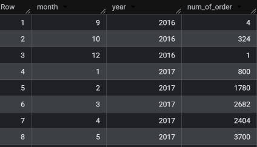
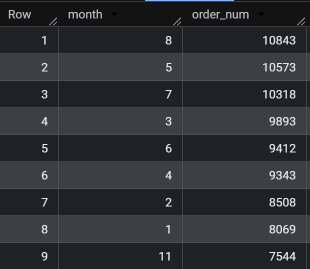
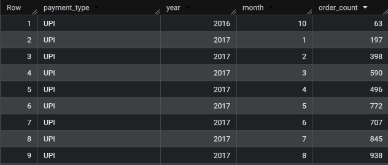
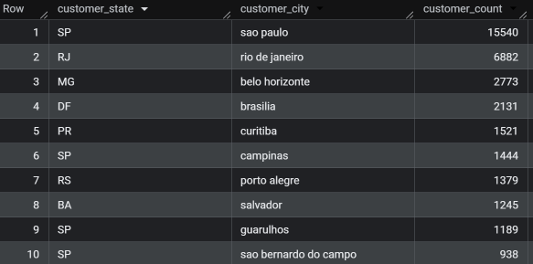
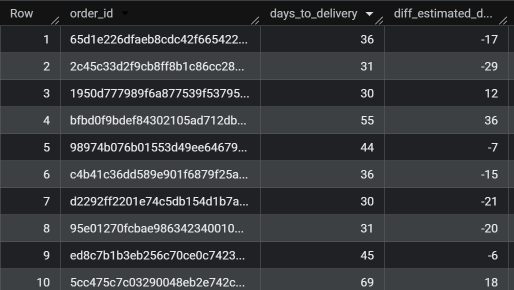

# 📊 E-Commerce Data Analysis using BigQuery

## 🚀 Project Overview

This project focuses on analyzing an e-commerce dataset using SQL in Google BigQuery. The goal is to extract meaningful business insights related to sales trends, customer behavior, payment growth, and delivery performance.

---

## 📂 Project Structure

* **sql/** → SQL queries used for data analysis
* **outputs/** → Screenshots of key query results

---

## 🛠 Tools Used

* Google BigQuery
* SQL
* GitHub

---

## 📊 Key Insights

### 📈 Monthly Orders

👉 Orders show steady growth over time with noticeable peaks in certain months.

---

### 📉 Orders Trend

👉 Overall order volume demonstrates an increasing trend.

---

### 💰 Payment Growth

👉 Revenue shows consistent growth, indicating strong business performance.

---

### 👥 Customer Distribution

👉 Customers are concentrated in specific regions, highlighting key markets.

---

### 🚚 Delivery Analysis

👉 Delivery times vary significantly, suggesting opportunities for optimization.

---

## 📂 Dataset

The dataset is not included due to size limitations.

It contains multiple e-commerce tables including:

* customers
* orders
* order_items
* order_reviews
* payments
* products
* sellers
* geolocation

These tables were used to perform SQL-based analysis on sales, customer behavior, and delivery performance.

---

## 📌 Conclusion

This project demonstrates how SQL and BigQuery can be used to analyze real-world e-commerce data and generate actionable business insights.
